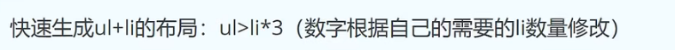

<h1>列表标签之无序列表</h1>

**无序列表实现**

    无序列表是一个项目的列表，此列项目使用粗体圆点（典型的小黑圆圈）进行标记
    无序列表始于<ul>。每个列表项始于<li>标签。

**type属性**

    <ul>的属性type拥有的选项

**常见应用场景**
    
    1.无序的列表效果
    2.导航效果

**导航效果**

**快捷键**
