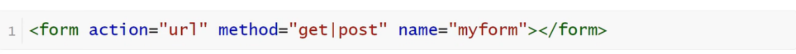

<h1>Form表单</h1>

表单在Web网页中用来给用户填写信息，从而能采用户信息，使网页具有交互的功能。

所有的用户输入内容的地方都用表单来填写，如登录注册、搜索框

表单是由容器和控件组成的，一个表单一般应该包含用户填写信息的输入框，提交按钮等，这些输入框，按钮叫做控件，表单就是容器，它能够容纳各种各样的控件

**属性说明**

    action服务器地址
    name表单名称
**method中Get和Post的区别**

    1.数据提交方式，get把提交的数据url可以看到，post看不到
    2.get一般用于提交少量数据，post用来提交大量数据

**表单元素**

    一个完整的表单包含三个基本组成部分：表单标签、表单域、表单按钮

