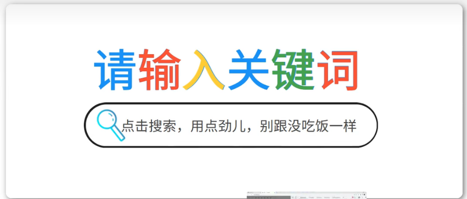
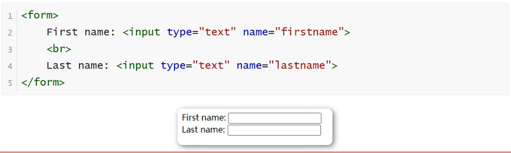
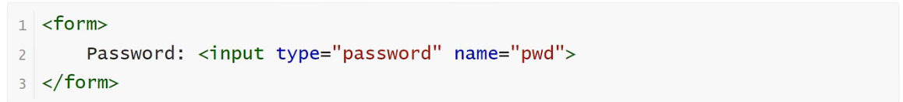
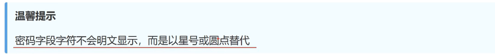
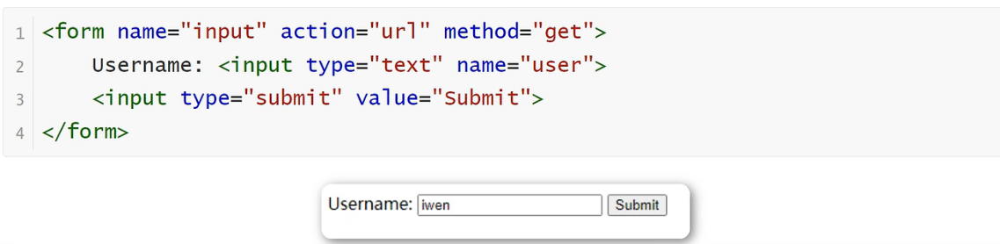

<h1>表单元素</h1>

**文本框**
    
    文本域通过<input type="text">标签来设定，当用户要在表单中键入字母、数字等内容时，就会用到文本域

**密码框**

    密码字段通过标签<input type="password">来定义

**提交按钮**

    当用户单击确认按钮时，表单的内容会被传送到另一个文件。表单的动作属性定义了目的文件的文件名。由动作（action）属性定义的这个文件通常会对接受到的数据进行相关的处理。

