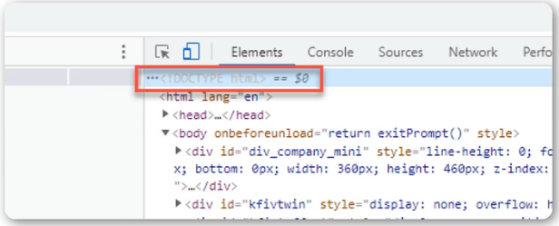
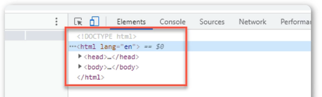
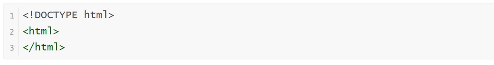
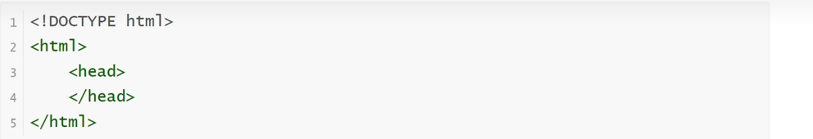
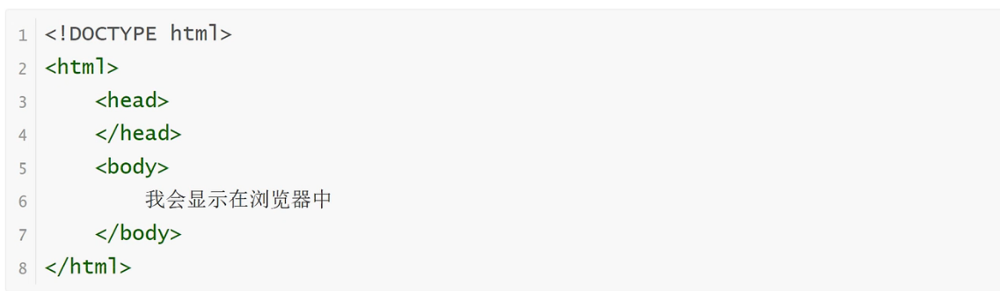
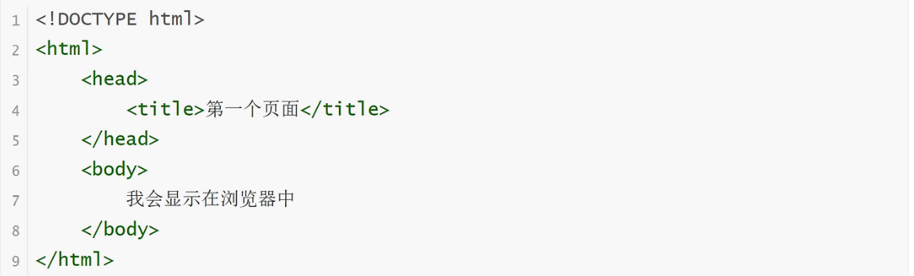
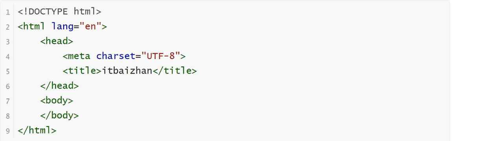

HTML5是用来描述网页的一种语言，被称为超文本标记语言。用HTML5编写的文件，后缀以.html结尾
HTML是一种标记语言，标记语言是一套标记标签。标签是由尖括号包围的关键字，如：<html>
标签有两种表现形式：
    1.双标签，例如：<html></html>
    2.单标签，例如：

HTML5的DOCTYPE声明
    DOCTYPE是document type（文档类型）的缩写。<!DOCTYPE html>是H5的声明位于文档的最前面，处于标签之前。
    他是网页必备的组成部分，避免浏览器的怪异模式（避免在不同浏览器效果不同）。
    

HTML5基本骨架
    

html标签
    定义HTML文档，这个元素我们浏览器看到后就明白这是个HTML文档了，所以你的其他元素要包裹在它里面，标签限定了文档的开始点和结束点
    

head标签
    head标签用于定义文档的头部。文档的头部描述了文档的各种属性和信息，包括文档的标题、在Web中的位置以及和其他文档的关系等。绝大多数文档头部包含的数据都不会真正做为内容显示给读者
    

body标签
    body元素定义文档的主体
    body元素包含文档的所有内容（比如文本、超链接、图像、表格和列表等等）
    它会直接在页面中显示出来，也就是用户可以直观看到的内容
    

title标签
    1.可定义文档的标题。
    2.他显示在浏览器窗口的标题栏或状态栏上。
    3.title标签是head标签中唯一必须要求包含的东西，就是说写head一定要写title
    4.title的增加有利于SEO优化（SEO是搜索引擎优化的英文缩写。通过对网站内容调整，满足搜索引擎的排名需求）
    

meta标签
    meta标签用来描述一个HTML网页文档的属性，关键词等，例如：charset="utf-8"是说当前使用的是utf-8编码格式，在开发中我们经常会看到utf-8，或是gbk，这些都是编码格式，通常使用utf-8
        