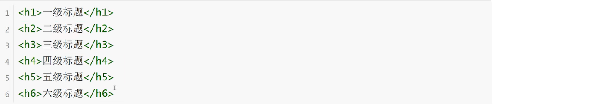

<h1>标题介绍与应用</h1>
标题（Heading）是通过h1-h6标签进行定义的
h1定义最大的标题，h6定义最小的标题

生成h1~h6快捷键：h$*6

**正确使用标题**

    请确保将HTML标题标签只用于标题
    不要仅仅是为了粗体或大号的文本而使用标题
    正确使用标题有益于SEO
    应该将h1用作主标题（最重要的），其后是h2（次重要的），再其次是h3，以此类推

**标题标签位置摆放**

    在标签中添加属性：align="left|center|right"默认居左
