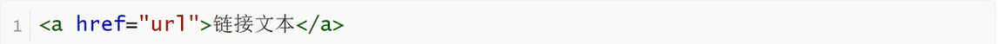
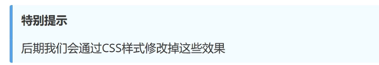

<h1>标签之超文本链接</h1>

**超链接描述**

    HTML使用标签a来设置超文本链接
    超链接可以是一个字，一个词，或者一组词，也可以是一幅画像，可以点击这些内容来跳转到新的文档或者当前文档中的某个部分

**超链接属性**

    在标签a中使用了href属性来描述链接的地址
    默认情况下，链接将以以下形式出现在浏览器中：
        1.一个未访问过的链接显示为蓝色字体并带有下划线
        2.访问过的链接显示为紫色并带有下划线
        3.点击链接时，链接显示为红色并带有下划线

**超链接表现**

