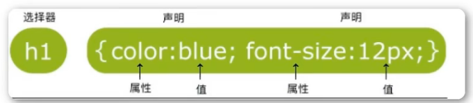
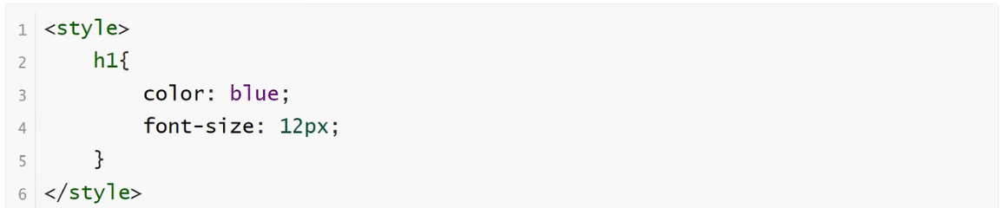

<h1>CSS简介</h1>

**CSS概念**

    CSS(Cascading Style Sheets)层叠样式表，又叫级联样式表，简称样式表
    CSS文件后缀名为.css
    CSS用于HTML文档中元素样式的定义

**为什么需要CSS**

    使用CSS的目的就是让网页具有美观一致的页面

**语法**

    CSS规则由两个主要的部分构成：选择器，以及一条或多条声明
    选择器通常是需要改变样式的HTML元素
    每条声明由一个属性和一个值组成
    属性（property）是希望设置的样式属性（style attribute）。每个属性有一个值。属性和值被冒号分开

