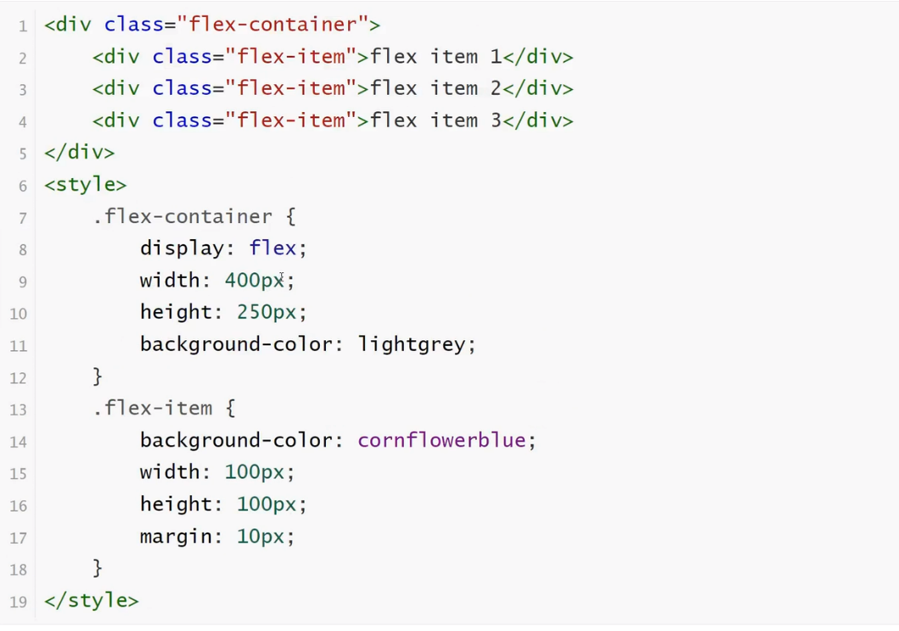
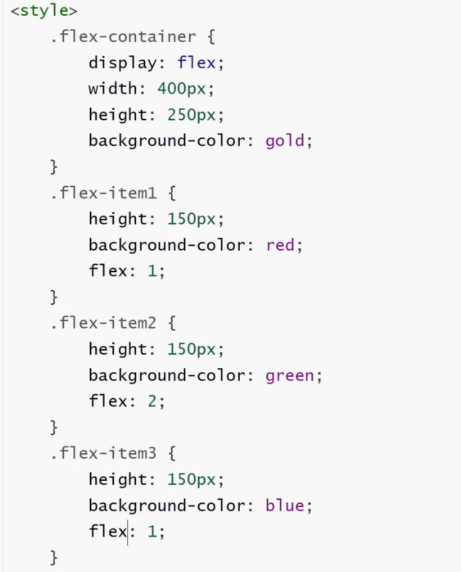

<h1>弹性盒模型（flex box）</h1>

<b style="font-size:20px">定义</b>

    弹性盒子是CSS3的一种新的布局模式
    CSS3弹性盒是一种当页面需要适应不同的屏幕大小以及设备类型时确保元素拥有恰当的行为的布局方式
    引入弹性盒布局模型的目的是提供一种更加有效的方式来对一个容器中的子元素进行排列、对齐和分配空白间

<b style="font-size:20px">CSS3弹性盒内容</b>

    弹性盒子由弹性容器（Flex container）和弹性子元素（Flex item）组成
    弹性容器通过设置display属性的值为flex将其定义为弹性容器
    弹性容器内包含了一个或多个弹性子元素

<b style="font-size:20px">父元素上的属性</b> 

<b style="font-size:20px">display属性</b>

    display:flex;开启弹性盒
    display:flex;属性设置后子元素默认水平排列

<b style="font-size:20px">flex-direction属性</b>

<b style="font-size:20px">定义</b>

    flex-direction属性指定了弹性子元素在父容器中的位置

<b style="font-size:20px">语法</b>

<b style="font-size:20px">justify-content属性</b>

<b style="font-size:20px">定义</b>

    内容对齐（justify-content）属性应用在弹性容器上，把弹性项沿着弹性容器的主轴线（main axis）
<b style="font-size:20px">语法</b>

<b style="font-size:20px">align-items属性</b>

<b style="font-size:20px">定义</b>

    align-items设置或检索弹性盒子元素在侧轴（纵轴）方向上的对齐方式

<b style="font-size:20px">语法</b>

<b style="font-size:20px">子元素上的属性</b>

<b style="font-size:20px">flex-grow/flex</b>

    flex-grow根据弹性盒子元素所设置的扩展因子作为比率来分配剩余空间
    默认为0，即如果存在剩余空间，也不放大
    如果只有一个子元素设置，那么按扩展因子转化的百分比对其分配剩余空间。0.1即10%，1即100%，超出按100%

