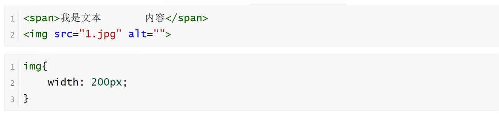
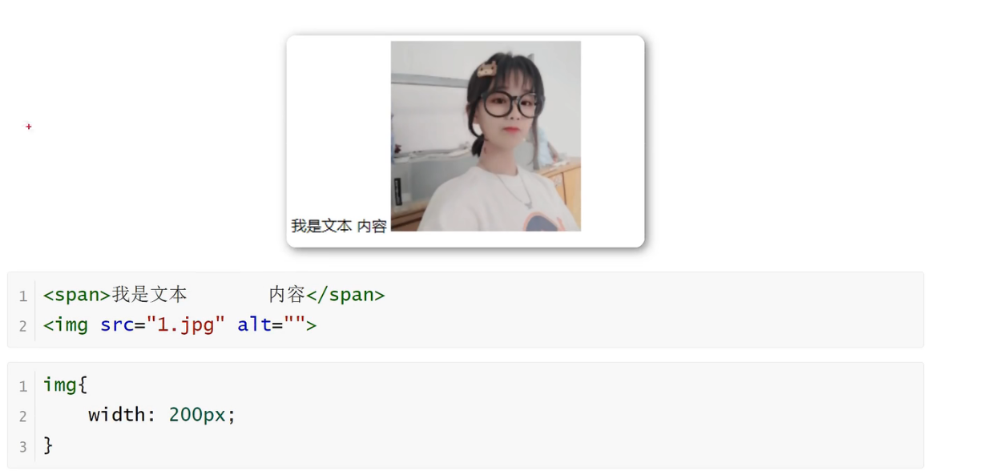
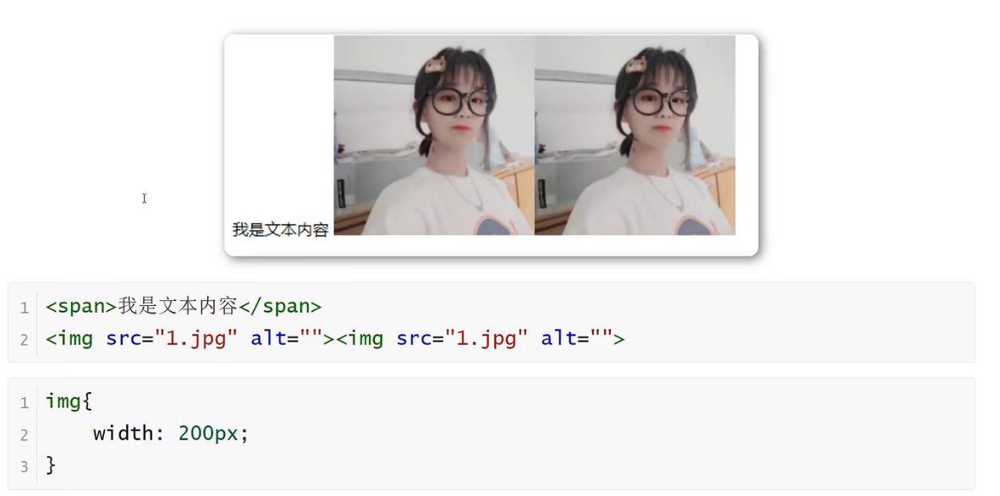

<h1>文档流</h1>

文档流是文档中可显示对象在排列是所占用的位置/空间

例如：块元素自上而下摆放，内联元素，从左到右摆放

标准流里面的限制非常多，导致很多页面效果无法实现

<b style="font-size:20px">高矮不齐，底边对齐</b>

<b style="font-size:20px">空格折叠</b>

<b style="font-size:20px">元素无空隙</b>

如果我们现在就要并排顶部对齐，那该怎么办呢？办法是：移民！脱离标准流！

<b style="font-size:20px">脱离文档流</b>

    是一个元素脱离标准文档流有三种方式：
    1.浮动
    2.绝对定位
    3.固定定位