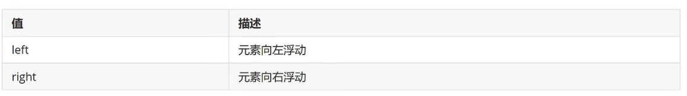
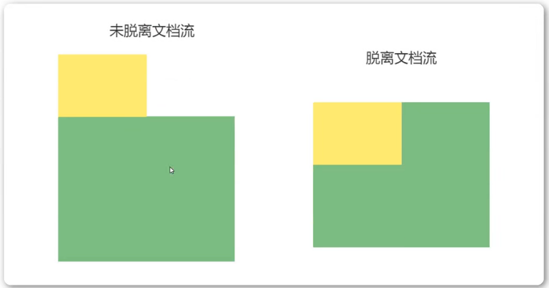
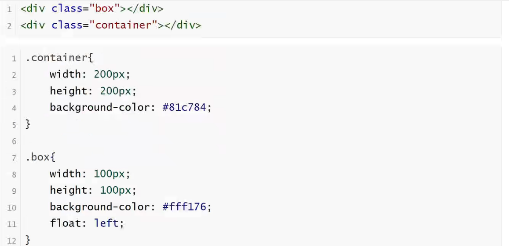
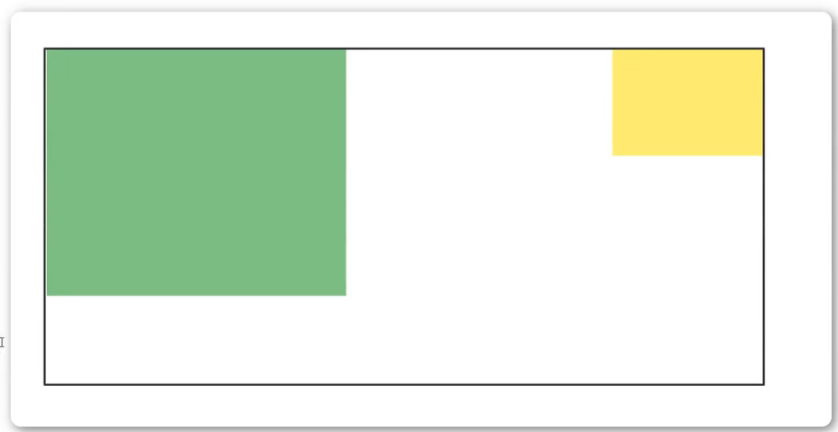
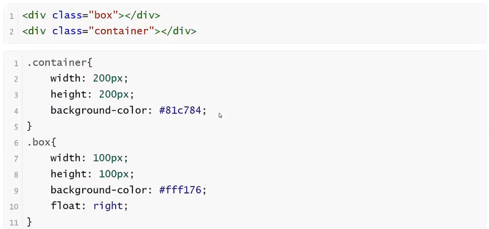
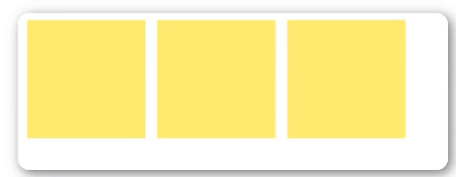
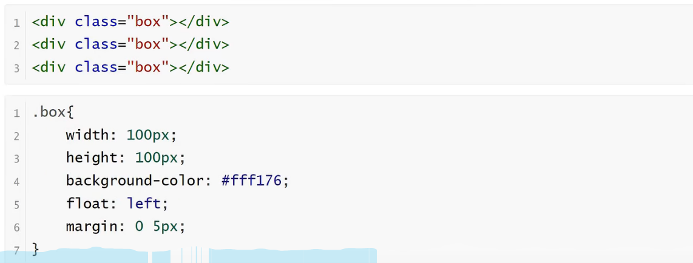
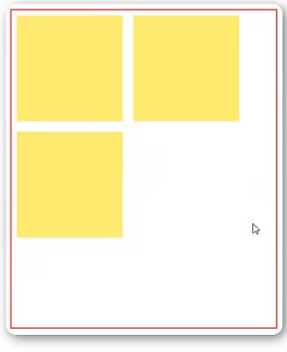

<h1>浮动</h1>

<b style="font-size:20px">浮动的定义</b>

    float属性定义元素在哪个方向浮动，任何元素都可以浮动

<b style="font-size:20px">浮动的原理</b>

    1.浮动以后使元素脱离了文档流
    2.浮动只有左右浮动，没有上下浮动

<b style="font-size:20px">元素向左浮动</b>
    
    脱离文档流之后，元素相当于在页面上增加一个浮层来放置内容。此时可以理解为有两层页面，一层是底层的原页面，一层是脱离文档流的上层页面，所以会出现折叠现象。

<b style="font-size:20px">元素向右浮动</b>

<b style="font-size:20px">所有元素向右浮动</b>

    当所有元素同时浮动的时候，会变成水平摆放，向左或者向右

<b style="font-size:20px">当容器不足时</b>

    当容器不足以横向摆放内容的时候，会在下一行摆放

  