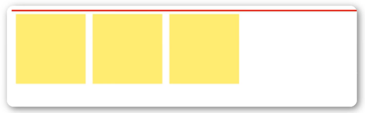
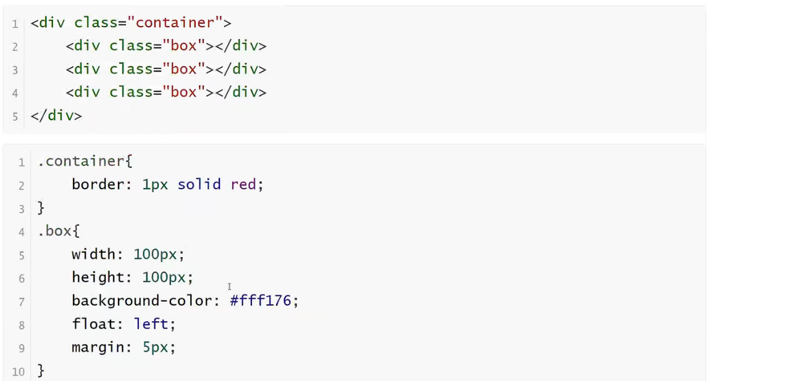
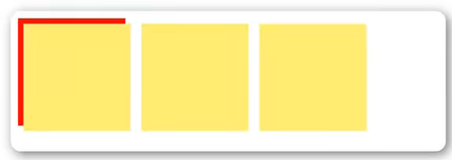
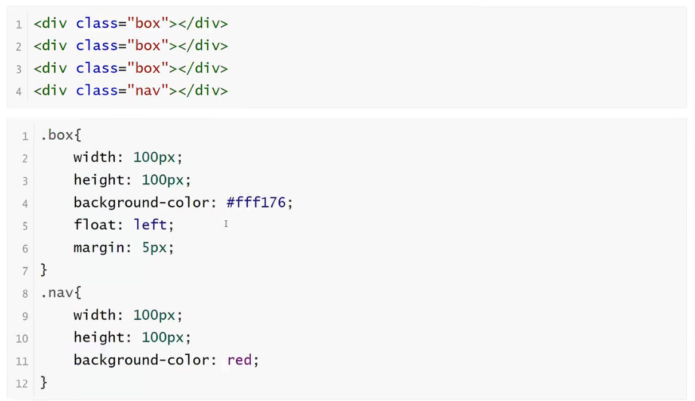
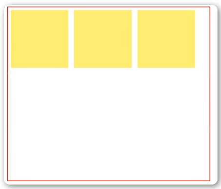
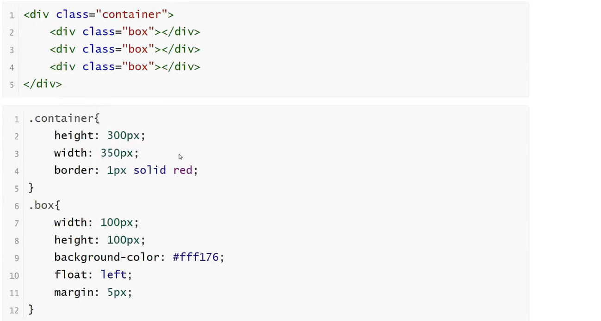
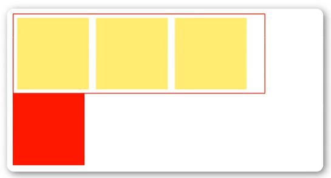
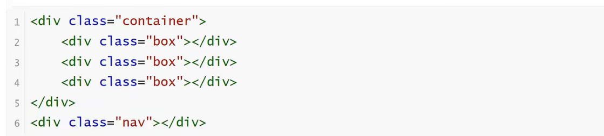
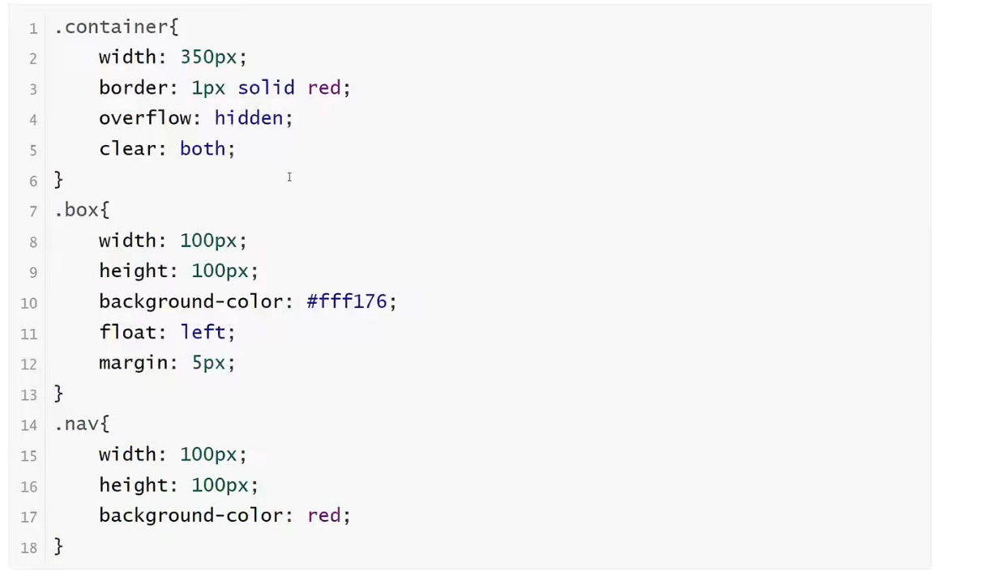
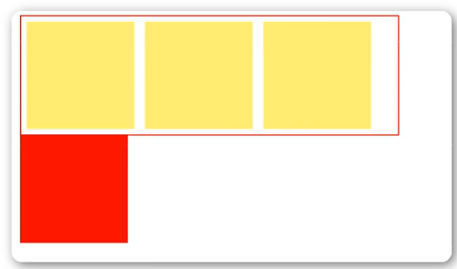

<h1>清除浮动</h1>

<b style="font-size:20px">浮动副作用</b>

    当元素设置float浮动后，该元素就会脱离文档流并向左/右浮动，
    1.浮动元素会造成父元素高度塌陷
    2.后续元素会受到影响

<b style="font-size:20px">清除浮动</b>

    当父元素出现塌陷的时候，对布局是不利的，所以我们必须清除副作用
    解决方案有很多种
    1.父元素设置高度
    2.受影响的元素增加clear属性
    3.overflow清除浮动
    4.伪对象方式

<b style="font-size:20px">父元素设置高度</b>

    如果父元素高度塌陷，可以给父元素设置高度，撑开元素本身大小

<b style="font-size:20px">overflow清除浮动（最常用）</b>

    如果有父级塌陷，并且同级元素也受到了影响，可以使用overflow清除浮动
    这种情况下，父布局不能设置高度
    父级标签的样式里面加：overflow:hideen;clear:both;

<b style="font-size:20px">伪对象方式</b>

    如果有父级塌陷，并且同级元素也受到了影响，还可以使用伪对象方式处理
    为父标签添加伪类after，设置空的内容，并且使用clear:both;
    这种情况下，父布局不能设置高度

