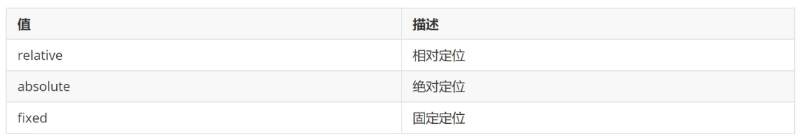
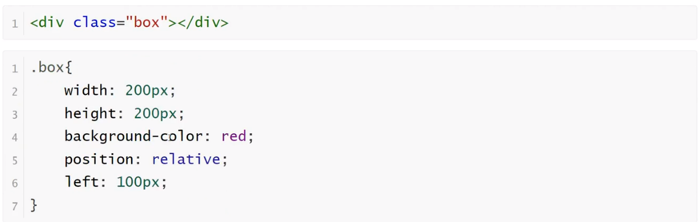
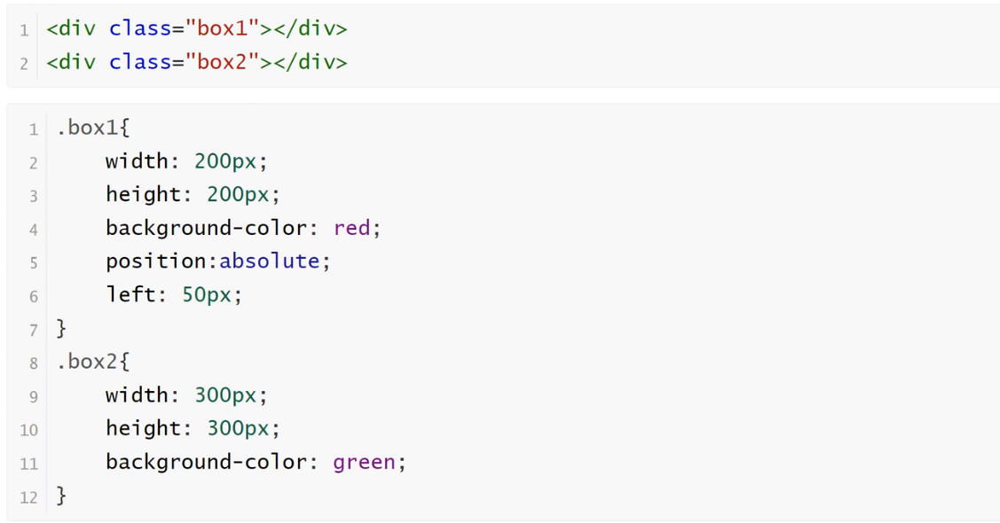
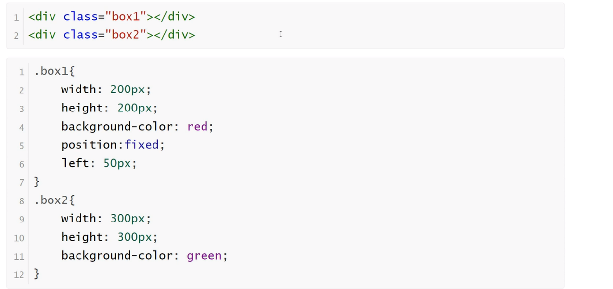
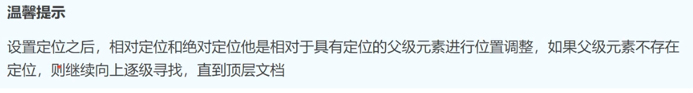

<h1>定位</h1>

<b style="font-size:20px">定义</b>

    position属性指定了元素的定位类型
    其中，绝对定位和固定定位会脱离文档流
    设置定位之后：可以使用四个方向值进行调整位置:left、top、right、bottom

<b style="font-size:20px">相对定位</b>

<b style="font-size:20px">绝对定位</b>

<b style="font-size:20px">固定定位</b>

<b style="font-size:20px">Z-index</b>

    z-index属性设置元素的堆叠顺序。拥有更高堆叠顺序的元素总是会处于堆叠顺序较低的元素的前面

    