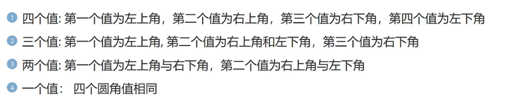
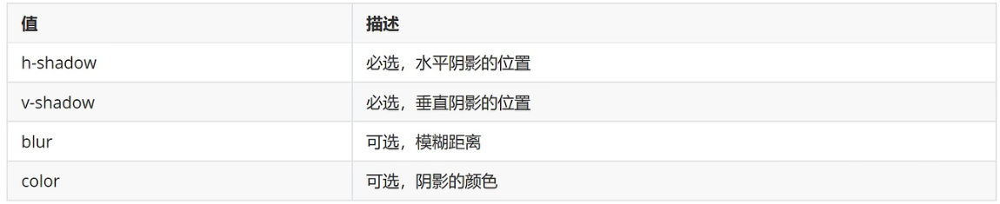
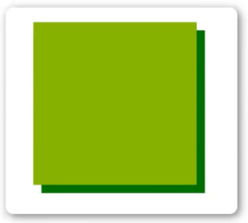

<h1>CSS3新特性</h1>

<b style="font-size:20px">圆角</b>

    使用CSS3 border-radius属性，可以给任何元素设置“圆角”
    border-radius属性，可以使用以下规则：

<b style="font-size:20px">阴影</b>

    box-shadow向框添加一个或多个阴影。
    box-shadow:h-shadow v-shadow blur color;

