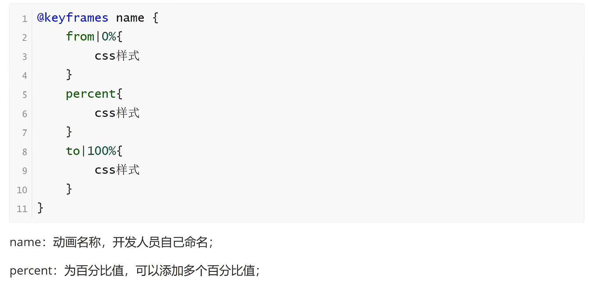
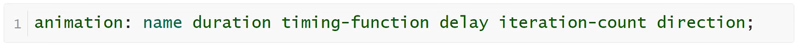
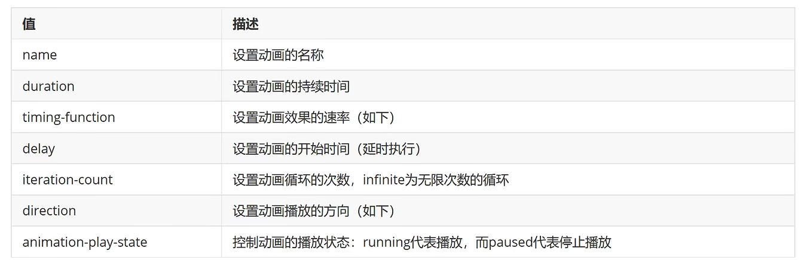
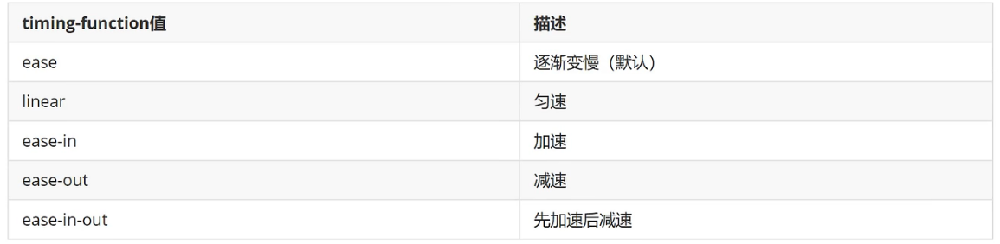
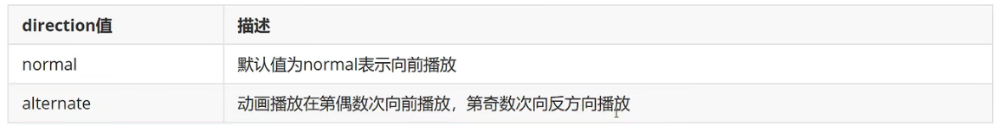
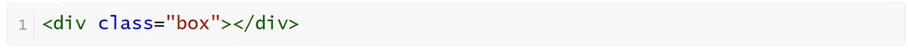
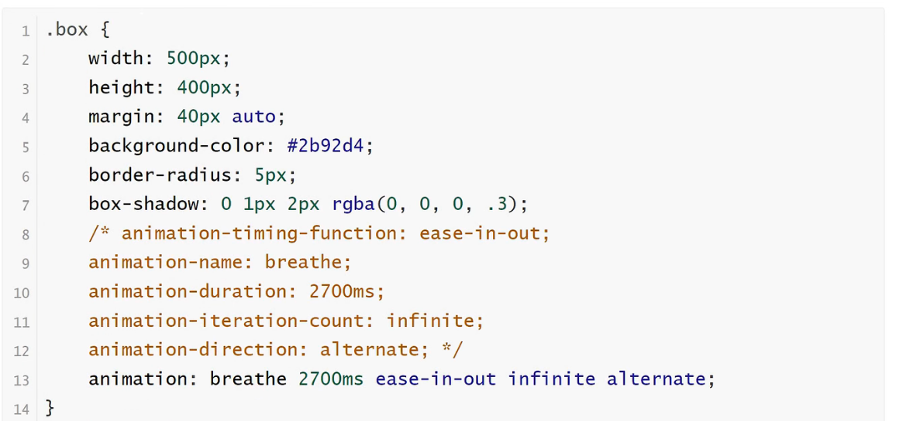
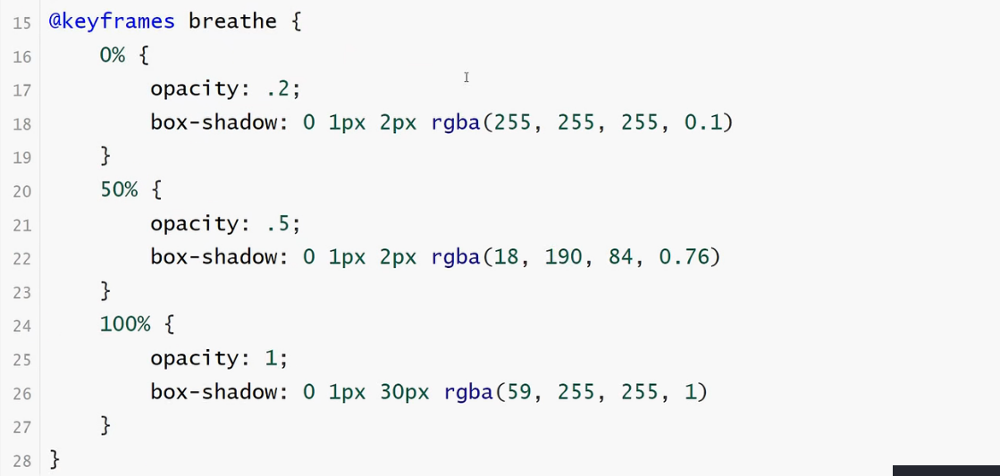

<h1>动画</h1>

动画是使元素从一种样式逐渐变化为另一种样式的效果

可以改变任意多的样式任意多的次数

请用百分比来规定变化发生的时间，或用关键词"from"和"to",等同于0%和100%

<b style="font-size:20px">@keyframes创建动画</b>

        使用@keyframes规则，你可以创建动画

<b style="font-size:20px">animation执行动画</b>

<b style="font-size:20px">呼吸效果</b>

