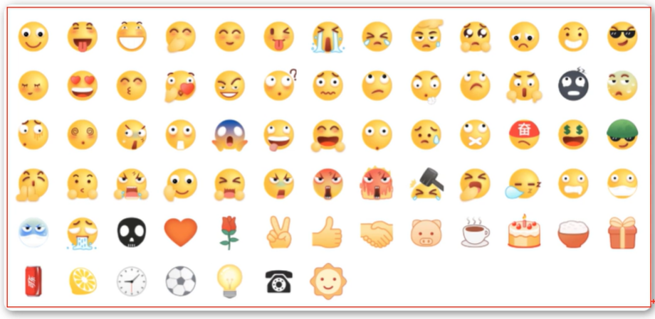
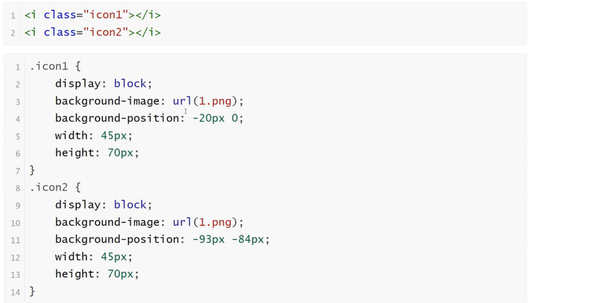

<h1>雪碧图</h1>

CSS Sprite也叫CSS精灵图、CSS雪碧图，是一种网页图片应用处理方式。它允许你将一个页面涉及到的所有零星图片都包含到一张大图中去

<b style="font-size:20px">优点</b>

    减少图片的字节
    减少网页的http请求，从而大大的提高页面的性能

<b style="font-size:20px">原理</b>

    通过background-image引入背景图片
    通过background-position把背景图片移动到自己需要的位置

<b style="font-size:20px">实例</b>

