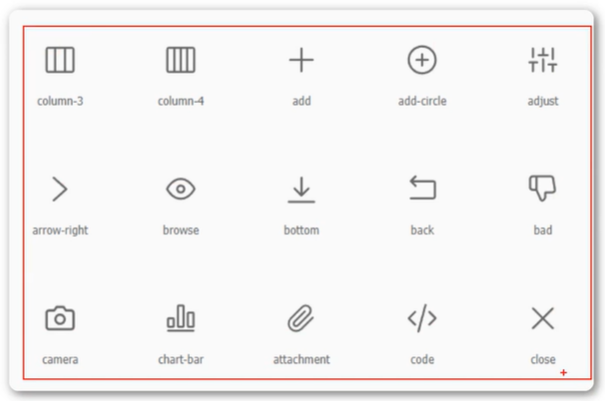

<h1>字体图标</h1>

我们会经常用到一些图标。但是我们在使用这些图标时，往往会遇到是真的情况，而且图片数量很多的话，页面加载就会越慢。所以，我们可以使用字体图标的方式来显示这些图标，即解决了失真的问题，也解决了图片占用资源的问题。

常用字体图标库：阿里字体图标库

<b style="font-size:20px">优点</b>

    1.轻量性：加载速度快，减少http请求
    2.灵活性：可以利用CSS设置大小颜色等
    3.兼容性：网页字体支持所有现代浏览器，包括IE低版本

<b style="font-size:20px">使用字体图标</b>

    1.注册账号并登录
    2.选取图标或搜索图标
    3.添加购物车
    4.下载代码
    5.选择font-class引用

