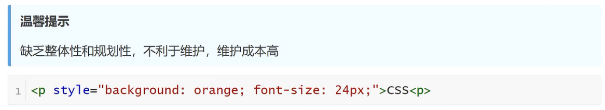
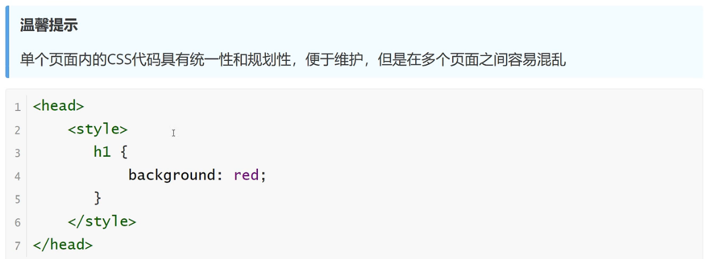
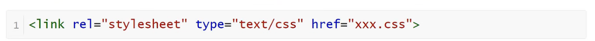

<h1>CSS的引入方式</h1>

**内联样式（行内样式）**

    要使用内联样式，你需要在相关的标签内使用样式（style）属性。Style属性可以包含任何CSS属性

**内部样式**

    当单个文档需要特殊的样式时，就应该使用内部样式表。你可以使用<style>标签在文档头部定义内部样式表

**外部样式（推荐）**

    当样式需要应用于很多页面时，外部样式表将是理想的选择。在使用外部样式表的情况下，你可以通过改变一个文件来改变整个站点的外观。每个页面使用<link>标签链接到样式表。<link>标签在文档的头部
