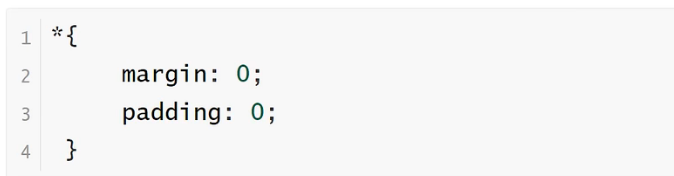
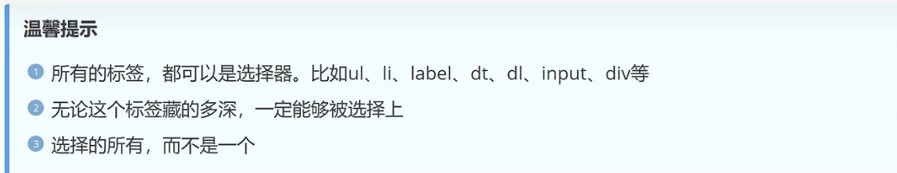
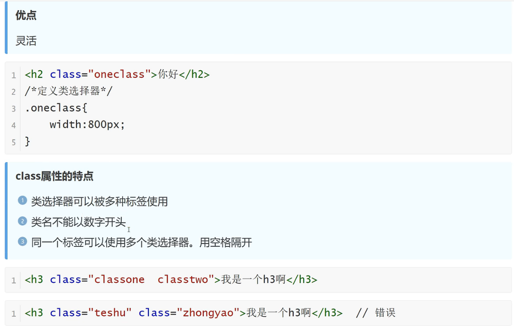
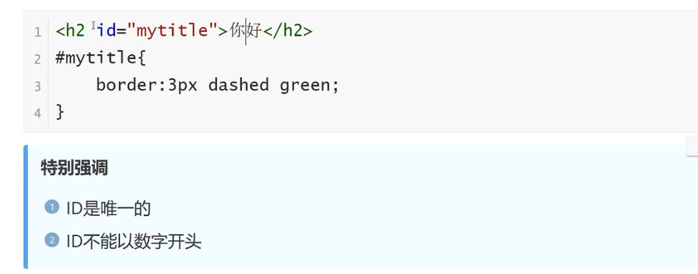
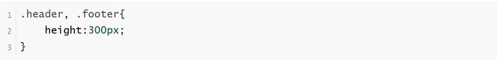

<h1>选择器</h1>

CSS语法 规则由两个主要的部分构成：<b>选择器</b>，以及一条或多条声明（样式）

**全局选择器**

    可以与任何元素匹配，优先级最低，一般做样式初始化

**元素选择器1**
    
    HTML文档中的元素，p、b、div、a、img、body等。
    标签选择器，选择的是页面上所有这种类型的标签，所以经常描述“共性”，无法描述某一个元素的“个性”

    
**元素选择器2**

    再比如说，我想让“学完前端，继续学Java”这句话中的“前端”两个变为红色字体，那么我可以用标签把“前端”这两个字围起来，然后给标签加一个标签选择器。

**类选择器（使用率最高）**

    规定用原点.来定义，针对你想要的所有标签使用

**ID选择器**

    针对某一个特定的标签来使用，只能使用一次。css中的ID选择器以#号来定义

**合并选择器**

    语法：选择器1，选择器2，...{}
    作用：提取共同的样式，减少重复代码

**选择器的优先级**

    CSS中，权重用数字衡量
    元素选择器的权重为：1
    class选择器的权重为：10
    id选择器的权重为：100
    内联样式的权重为：1000
    优先级从高到低：行内样式>ID选择器>类选择器>元素选择器