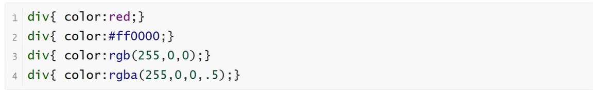
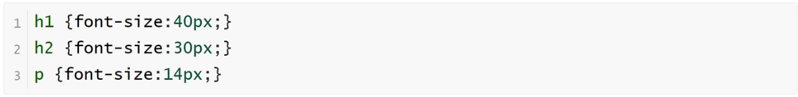
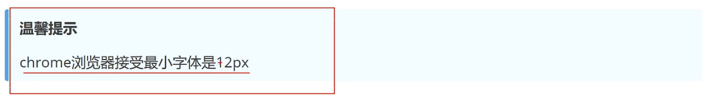
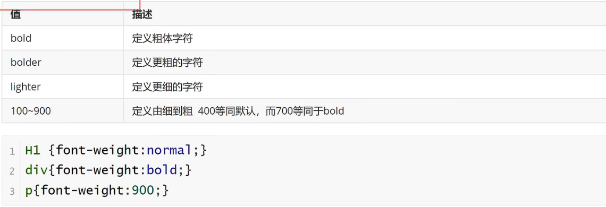
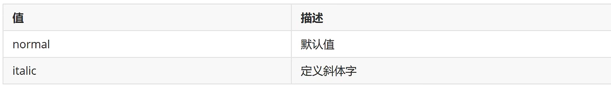
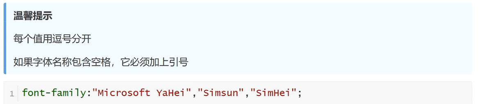

<h1>字体属性</h1>

CSS字体属性定义字体，颜色、大小，加粗，文字样式

**color**

    规定文本的颜色

**font-size**

    设置文本的大小
    能否管理文字的大小，在网页设计中是非常重要的。但是，你不能通过调整字体大小使段落看上去想标题，或者使标题看上去像段落。

**font-weight**

    设置文本的粗细

**font-style**

    指定文本的字体样式

**font-family**

    font-family属性指定一个元素的字体
