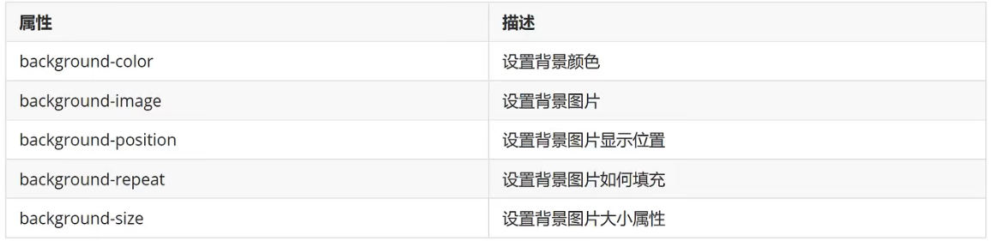
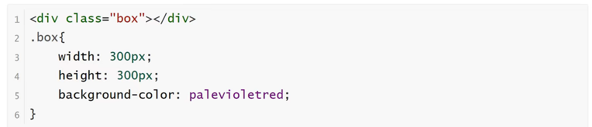
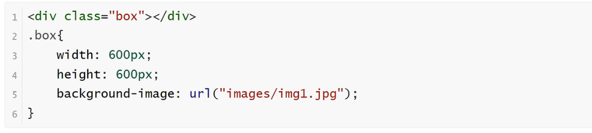
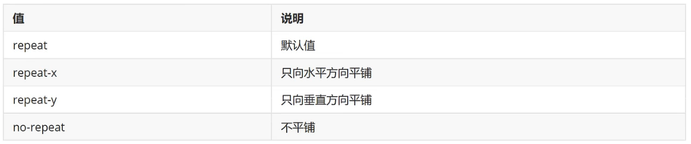
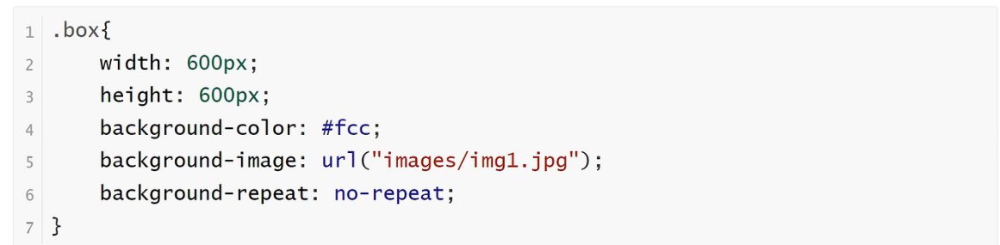
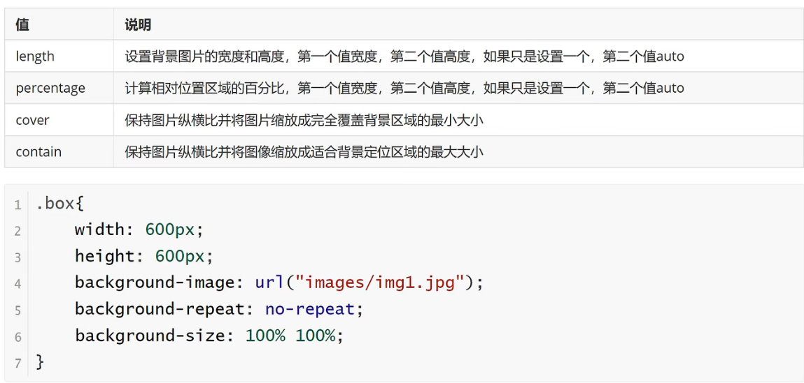
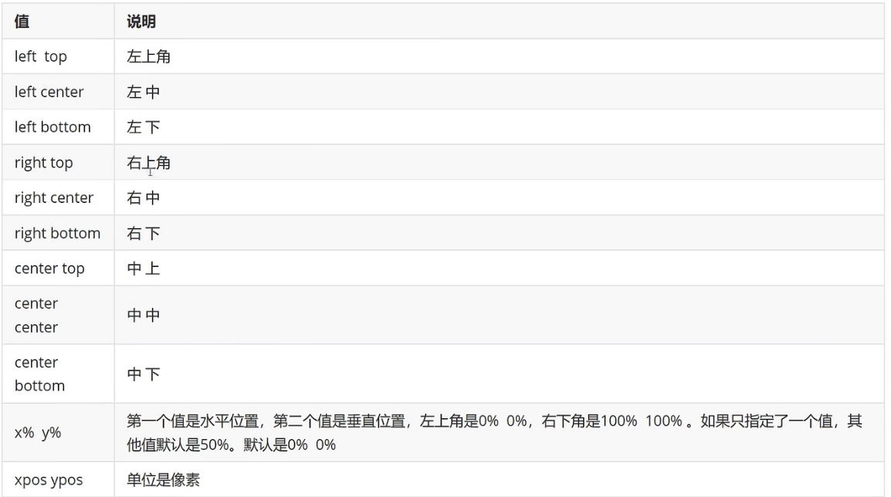

<h1>背景属性</h1>

CSS背景属性主要有以下几个

**background-color属性**

    该属性设置背景颜色

**background-image属性**

    设置元素的背景图像
    元素的背景是元素的总大小，包括填充和边界（不包括外边距）。默认情况下background-image属性放置在元素的左上角，如果图像不够大的话会在垂直和水平方向平铺图像，如果图像大小超过元素大小从图像的左上角显示元素大小的那部分

**background-repeat属性**

    该属性设置如何平铺背景图像

**background-size属性**

    该属性设置背景图像的大小

**background-position属性**

    该属性设置背景图像的起始位置，其默认值是0% 0%
