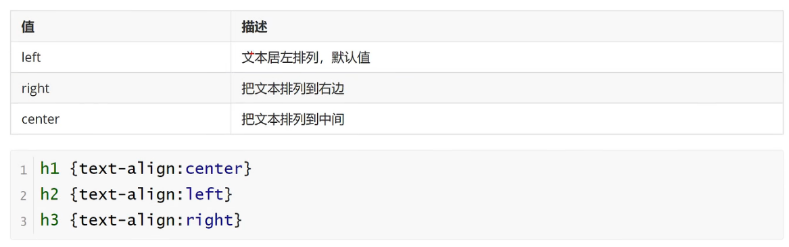
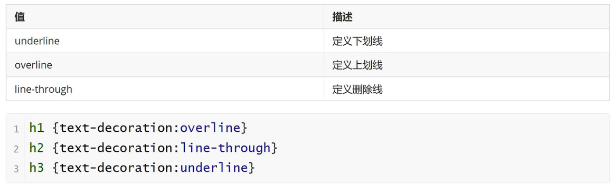
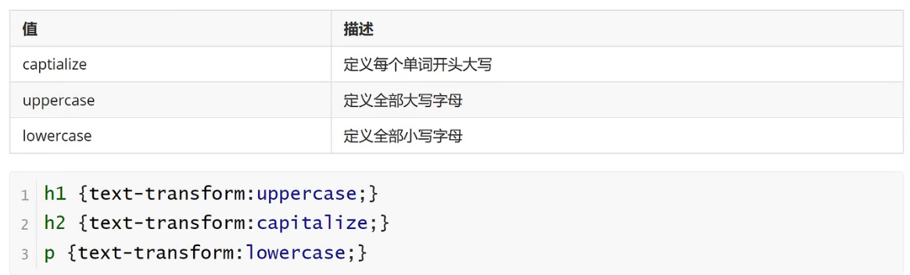
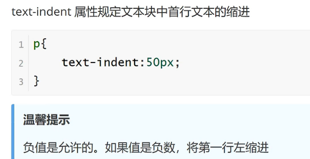

<h1>文本属性</h1>

<b style="font-size:20px">text-align</b>

    指定元素文本的水平对齐方式

<b style="font-size:20px">text-decoration</b>

    text-decoration属性规定添加到文本的修饰，下划线、上划线、删除线等

<b style="font-size:20px">text-transform</b>

    text-transform属性控制文本的大小写

<b style="font-size:20px">text-indent</b>

    text-indent属性规定文本块中首行文本的缩进
