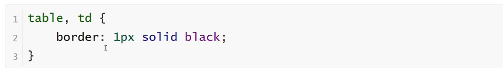
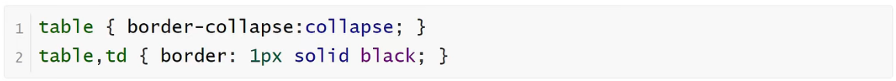
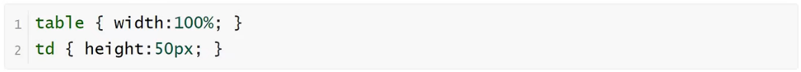
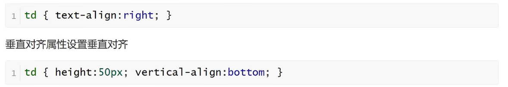
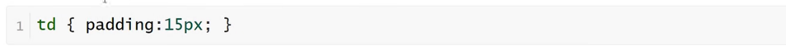
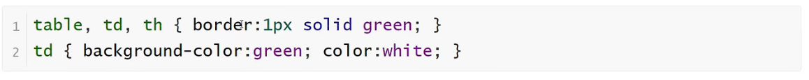

<h1>表格属性</h1>

使用CSS可以使HTML表格更美观

<b style="font-size:20px">表格边框</b>

    指定CSS表格边框，使用border属性
    

<b style="font-size:20px">折叠边框</b>

    border-collapse属性设置表格的边框是否被折叠成一个单一的边框或隔开

<b style="font-size:20px">表格宽度和高度</b>

    width和height属性定义表格的宽度和高度

<b style="font-size:20px">表格文字对齐</b>

    表格中的文本对齐和垂直对齐属性
    text-align属性设置水平对齐方式，向左，右，或中心

<b style="font-size:20px">表格填充</b>

    如果在表的内容中控制空格之间的边框，应使用td和th元素的填充属性

<b style="font-size:20px">表格颜色</b>

    下面的例子指定边框的颜色，和th元素的文本和背景颜色
