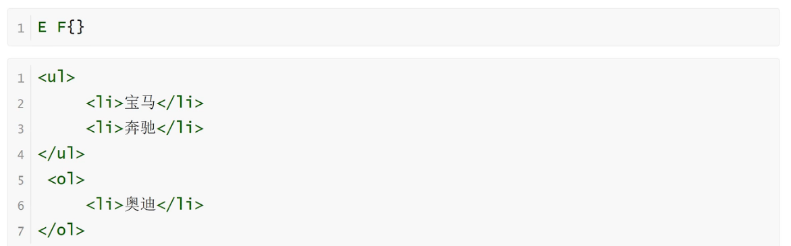
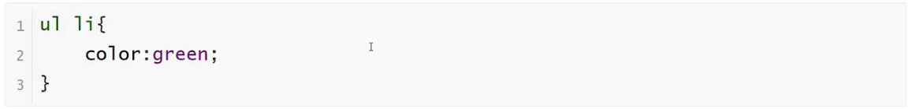
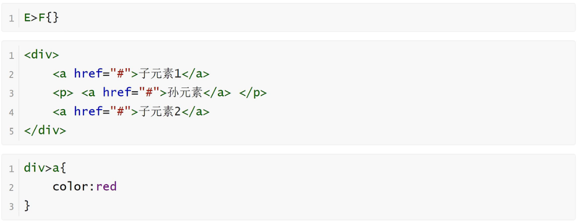
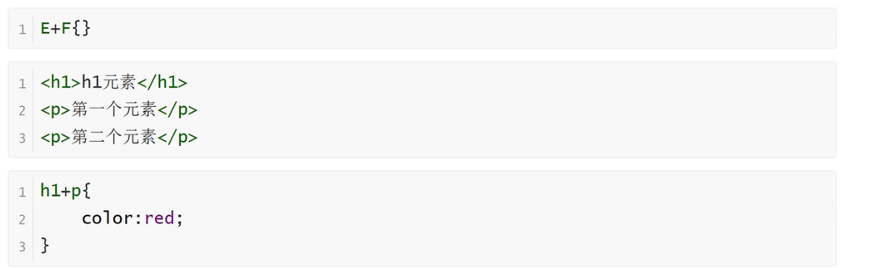
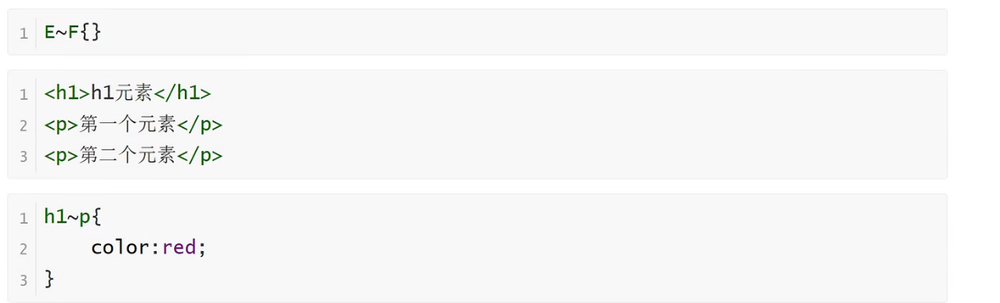

<h1>选择器关系</h1>

<b style="font-size:20px">关系选择器分类</b>

    1.后代选择器
    2.子代选择器
    3.相邻兄弟选择器
    4.通用兄弟选择器

<b style="font-size:20px">后代选择器</b>

<b>定义</b>

    选择所有被E元素包含的F元素，中间用空格隔开

<b>语法</b>

<b style="font-size:20px">子代选择器</b>

<b>定义</b>

    选择所有作为E元素的直接子元素F，对更深一层的元素不起作用，用>表示

<b>语法</b>

<b style="font-size:20px">相邻兄弟选择器</b>

<b>定义</b>

    选择紧跟E元素后的F元素，用加号表示，选择相邻的第一个兄弟元素，只能向下选择

<b>语法</b>

<b style="font-size:20px">通用兄弟选择器</b>

<b>定义</b>

    选择E元素之后的所有兄弟元素F，作用于多个元素，用~隔开

<b>语法</b>

