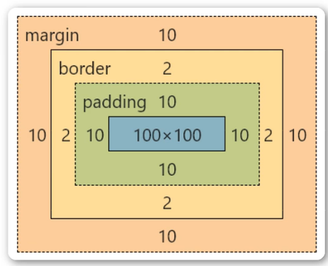
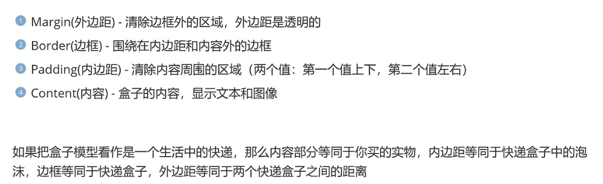
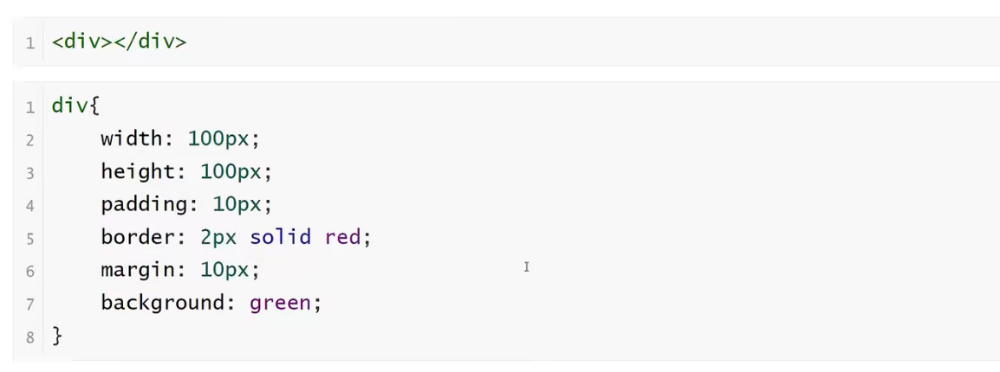

<h1>盒子模型(Box Model)</h1>

<b style="font-size:20px">概念</b>

    所有HTML元素可以看作盒子，在CSS中，“box model”这一术语是用来设计和布局时使用
    CSS盒模型本质上是一个盒子，封装周围的HTML元素，包括：
    外边距（margin），边框（border），内边距（padding），和实际内容（content）

