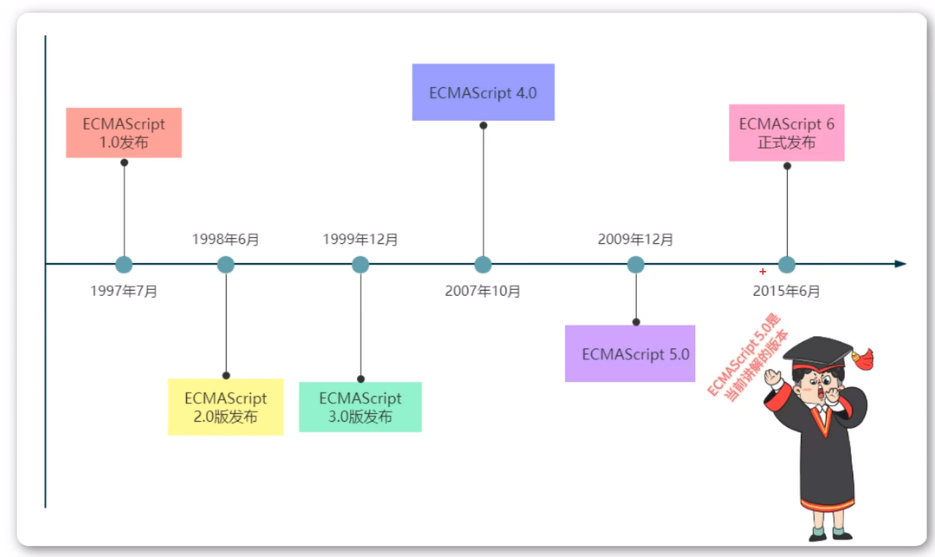

<h1>JavaScript简介</h1>

<b style="font-size:20px">JavaScript介绍</b>

    JavaScript是一种轻量级的脚本语言。所谓“脚本语言”，指的是它不具备开发操作系统的能力，而是只用来编写控制其它大型应用程序的“脚本”。
    JavaScript是一种嵌入式（embedded）语言。它本身提供的语法核心不算很多

<b style="font-size:20px">为什么学习JavaScript</b>

    操控浏览器的能力
    广泛的使用领域
    易学性

<b style="font-size:20px">JavaScript与ECMAScript的关系</b>

    ECMAScript和JavaScript的关系是，前者是后者的规格，后者是前者的一种实现。在日常场合中，这两个词是可以互换的。

<b style="font-size:20px">JavaScript版本</b>

 