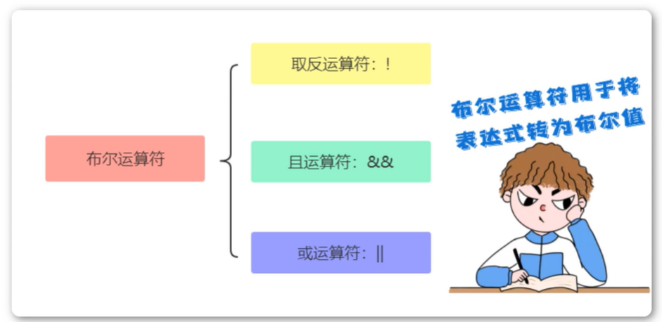
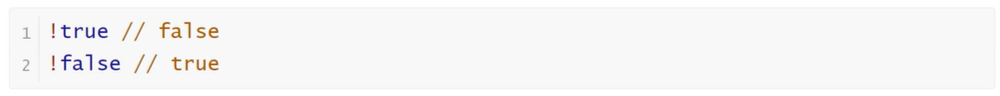
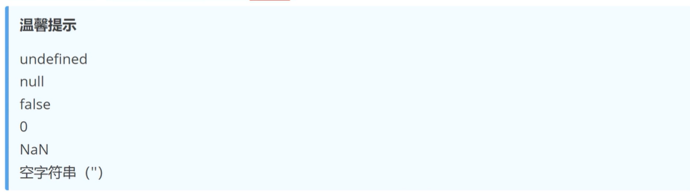
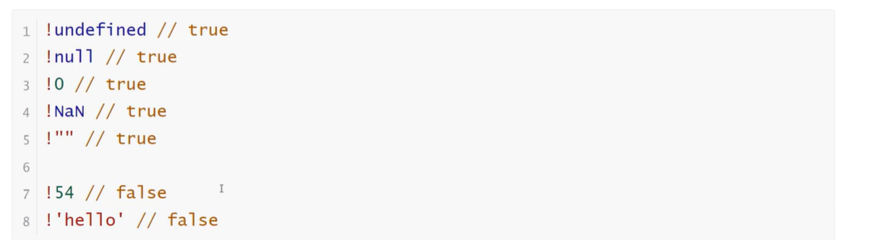
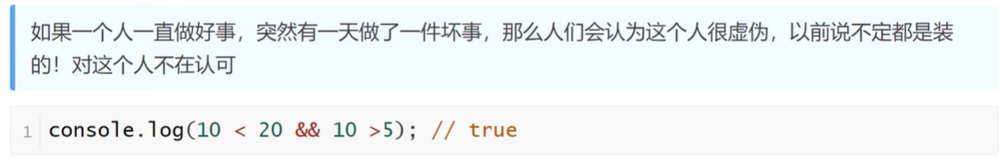
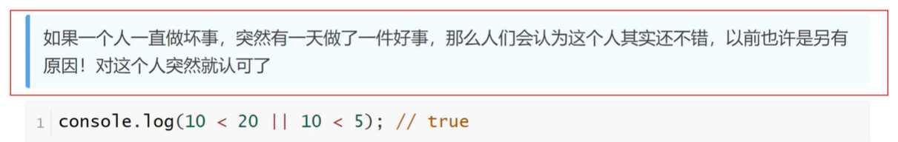

<h1>运算符之布尔运算符</h1>

<b style="font-size:20px">取反运算符(!)</b>

布尔值取反

非布尔值取反

对于非布尔值，取反运算符会将其转为布尔值。可以这样记忆，以下六个值取反后为true，其他值都为false

<b style="font-size:20px">且运算符（&&）</b>

多个条件都要满足

<b style="font-size:20px">或运算符（||）</b>

满足一个条件即可

