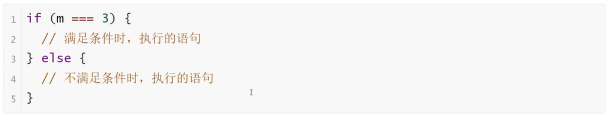

<h1>条件语句之if...else</h1>

<b style="font-size:20px">if...else基本结构</b>

    if代码块后面，还可以跟一个else代码块，表示不满足条件时所要执行的代码

<b style="font-size:20px">多个if...else连接</b>

    对一个变量进行多次判断时，多个if...else语句可以连写在一起

<b style="font-size:20px">if...else嵌套</b>

