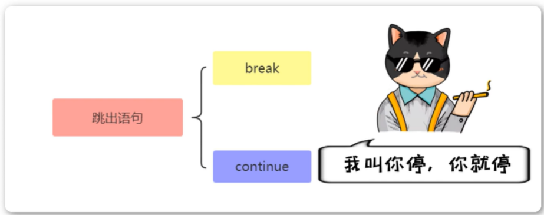
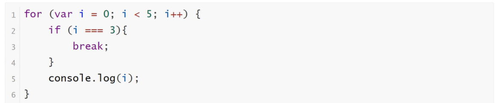
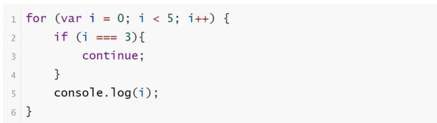
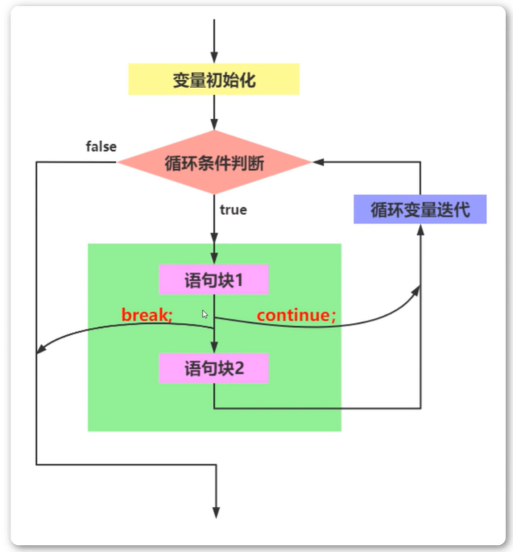

<h1>break语句和continue语句</h1>

break语句和continue语句都具有跳转作用，可以让代码不按既有的顺序执行

<b style="font-size:20px">break</b>

    break语句用于跳出代码块或循环

<b style="font-size:20px">continue</b>

    continue语句用于立即终止本轮循环，返回循环结构的头部，开始下一轮循环

