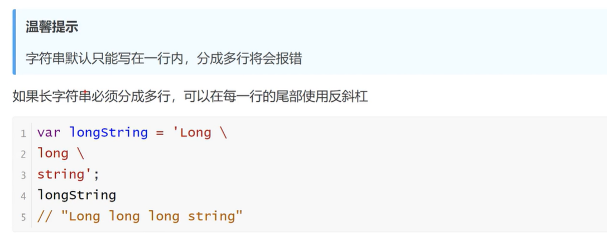

<h1>字符串</h1>

字符串就是零个或多个排在一起的字符，放在单引号或双引号之中

单引号字符串的内部，可以使用双引号。双引号字符串的内部，可以使用单引号

如果要在单引号字符串的内部，使用单引号，就必须在内部的单引号前面加上反斜杠，用来转义。双引号字符串内部使用双引号，也是如此。

<b style="font-size:20px">length属性</b>

    length属性返回字符串的长度，该属性也是无法改变的
