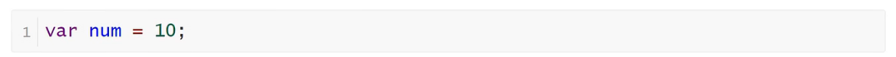
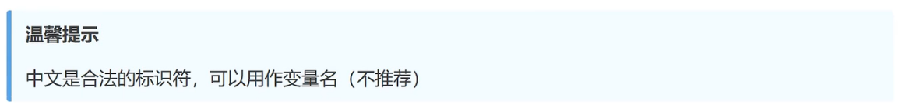
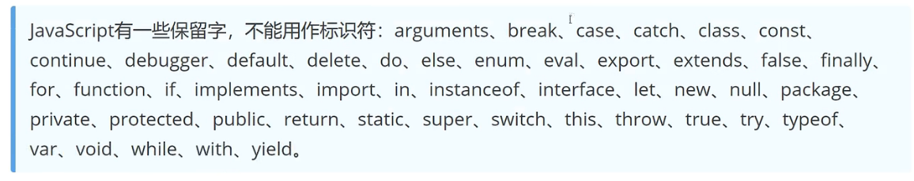

<h1>JavaScript语句、标识符</h1>

<b style="font-size:20px">语句</b>

    JavaScript程序的单位是行（line），也就是一行一行地执行。一般情况下，每一行就是一个语句
    语句以分号结尾，一个分号就表示一个语句结束

<b style="font-size:20px">标识符</b>

    标识符（identifier）指的是用来识别各种值的合法名称。最常见的标识符就是变量名
    标识符是由：字母、美元符号（$）、下划线（_）和数字组成，其中数字不能开头

<b style="font-size:20px">JavaScript保留关键字</b>

    以下关键字不需要强行记忆！

