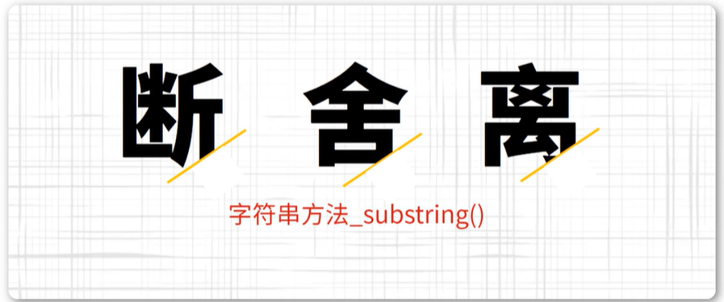
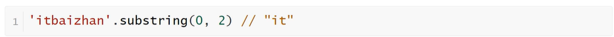
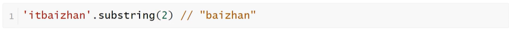
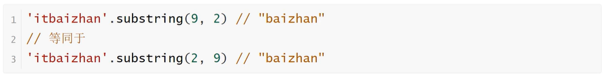
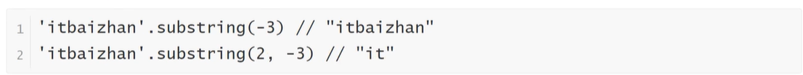

<h1>字符串方法_substring()</h1>

substring方法用于从原字符串取出子字符串并返回，不改变原字符串。它的第一个参数表示字符串的开始位置，第二个位置表示结束位置（返回结果不含该位置）

如果省略第二个参数，则表示子字符串一直到原字符串的结束

如果第一个参数大于第二个参数，substring方法会自动更换两个参数的位置

如果参数是负数，substring方法会自动将负数转为0

