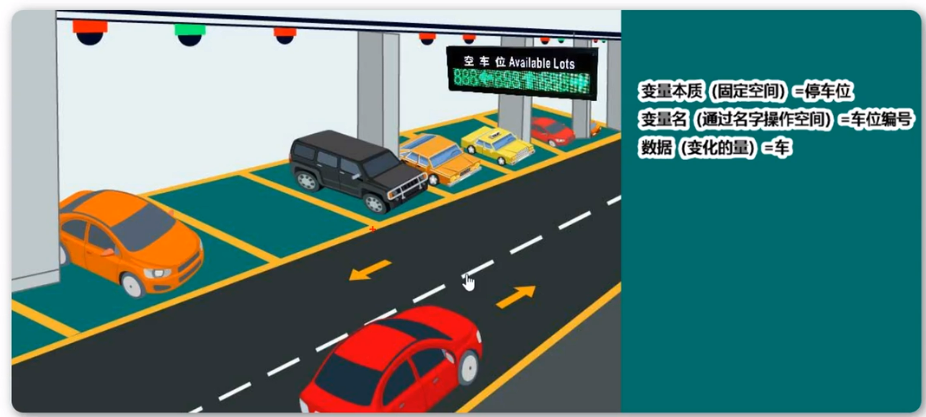
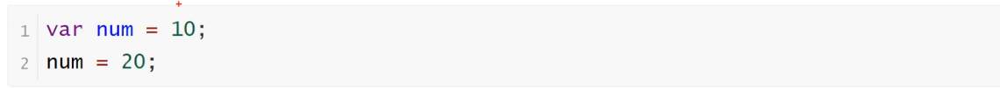
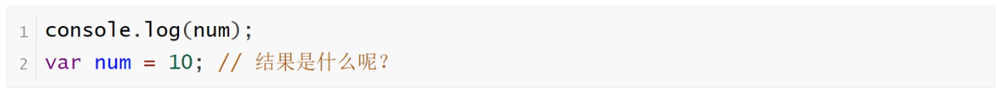

<b style="font-size:20px">变量</b>

<b style="font-size:20px">变量的重新赋值</b>

<b style="font-size:20px">变量提升</b>

    JavaScript引擎的工作方式是，先解析代码，获取所有被声明的变量，然后再一行一行地运行。这造成的结果，就是所有的变量的声明语句，都会被提升到代码的头部，这就叫做变量提升（hoisting）。
