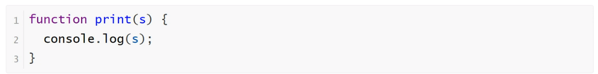
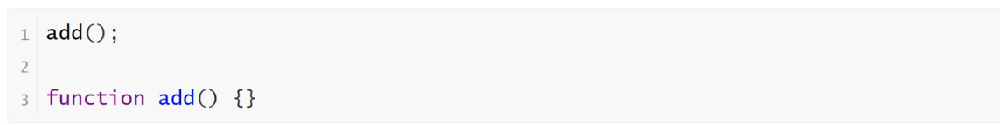
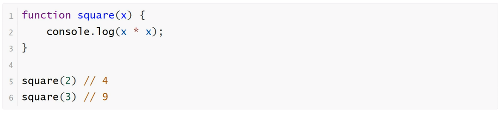
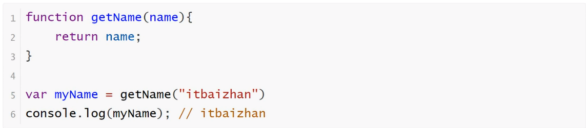

<h1>函数</h1>

函数是一段可以反复调用的代码块

<b style="font-size:20px">函数的声明</b>

    function命令：function命令声明的代码区块，就是一个函数。function命令后面是函数名，函数名后面是一对圆括号，里面是传入函数的参数。函数体放在大括号里面。

<b style="font-size:20px">函数名的提升</b>

    JavaScript引擎将函数名视同变量名，所以采用function命令声明函数时，整个函数会像声明变量一样，被提升到代码头部

<b style="font-size:20px">函数名的参数</b>

    函数运行的时候，有时需要提供外部参数，不同的外部数据会得到不同的结果，这种外部数据就叫参数

<b style="font-size:20px">函数名的返回值</b>

    JavaScript函数提供两个接口实现与外界的交互，其中参数作为入口，接收外界信息；返回值作为出口，把运算结果反馈给外界

