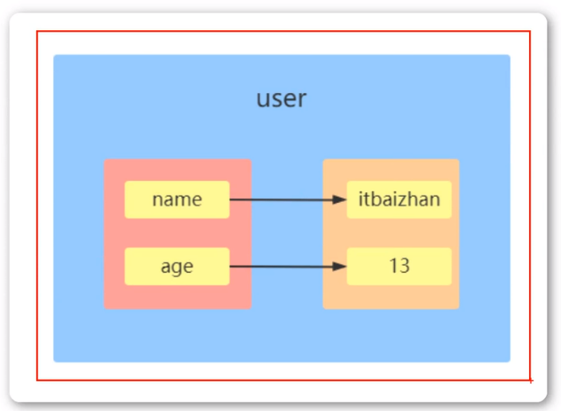
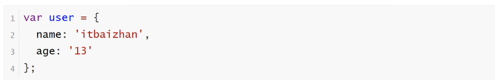
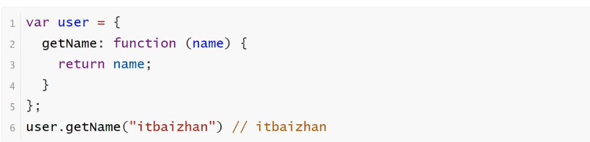
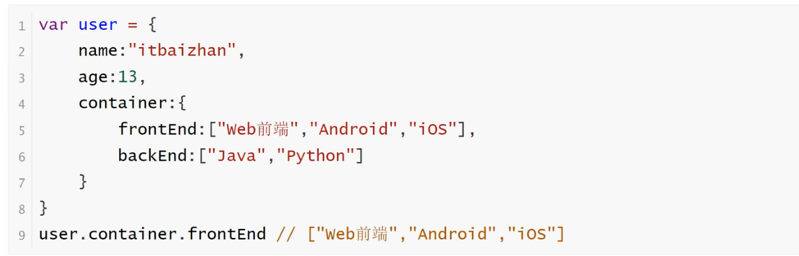

<h1>对象概述</h1>

什么是对象？对象（object）是JavaScript语言的核心概念，也是最重要的数据类型

简单说，对象就是一组键值对（key-value）的集合，是一种无序的复合数据集合

对象的每一个键名又称为“属性”（property），它的“键值”可以是任何数据类型。如果一个属性的值为函数，通常把这个属性称为“方法”，它可以像函数那样调用

如果属性的值还是一个对象，就形成了链式引用

