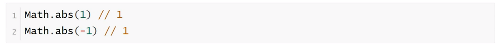
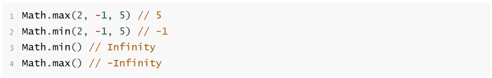
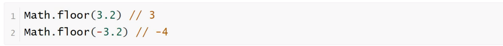
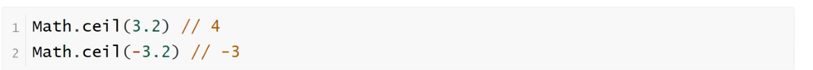
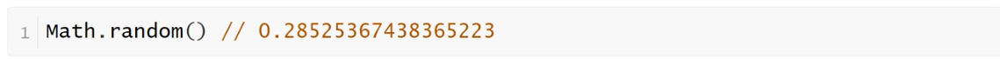
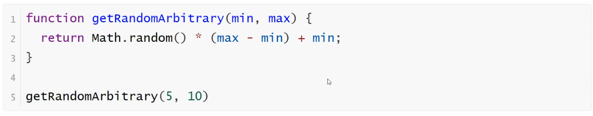

<h1>Math对象</h1>

Math是JavaScript的原生对象，提供各种数学功能。

<b style="font-size:20px">Math.abs()</b>

Math.abs方法返回参数值的绝对值

<b style="font-size:20px">Math.max(),Math.min()</b>

    Math.max方法返回参数之中最大的那个值，Math.min返回最小的那个值。如果参数为空，Math.min返回Infinity，Math.max返回-Infinity。

<b style="font-size:20px">Math.floor(),Math.ceil()</b>

    Math.floor方法返回小于参数值的最大整数
    Math.ceil方法返回大于参数值的最小整数

<b style="font-size:20px">Math.random()</b>

    Math.random()返回0到1之间的一个伪随机数，可能等于0，但是一定小于1

任意范围的随机数生成函数如下

