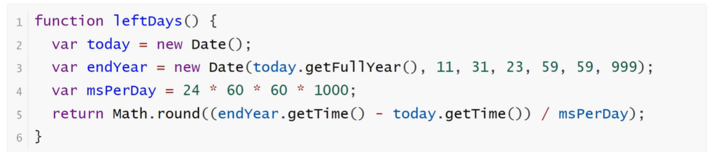

<h1>Date对象</h1>

 Date对象是JavaScript的原生时间库。它以1970年1月1日00:00:00作为时间的零点，可以表示的时间范围是前后各1亿天（单位为毫秒）

 <b style="font-size:20px">Date.now()</b>

    Date.now方法返回当前时间距离时间零点（1970年1月1日00:00:00 UTC）的毫秒数，相当于Unix时间戳乘以1000

 <b style="font-size:20px">时间戳</b>

    时间戳是指格林威治时间1970年01月01日00时00分00秒（北京时间1970年01月01日08时00分00秒）起至现在的总秒数

    格林威治和北京时间就是时区的不同

    Unix是20世纪70年代初出现的一个操作系统，Unix认为1970年1月1日是时间纪元。JavaScript也就遵循了这一约束

    Date对象提供了一些列get*方法，用来获取实例对象某个方面的值

 <b style="font-size:20px">实例方法get类</b>

 

 

  <b style="font-size:20px">编写函数获得本年度剩余天数</b>

 