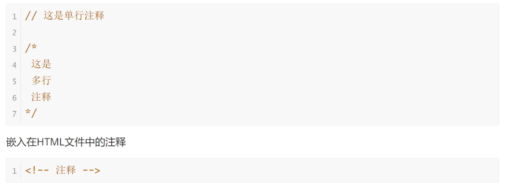
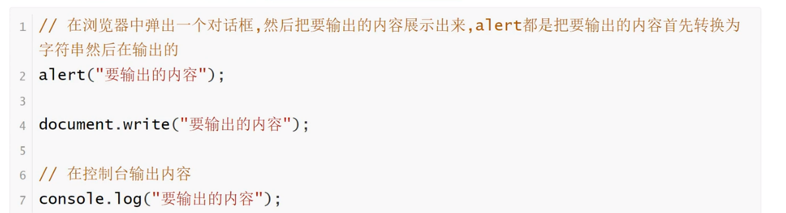

<h1>JavaScript注释与常见输出方式</h1>

<b style="font-size:20px">JavaScript注释</b>

    源码中注释是不被引擎所解释的，它的作用是对代码进行解释。JavaScript提供两种注释的写法：一种是单行注释，用//起头；另一种是多行注释，放在/和/之间

<b style="font-size:20px">JavaScript输出方式</b>

    JavaScript有很多种输出方式，都可以让我们更直观地看到程序运行的结果
