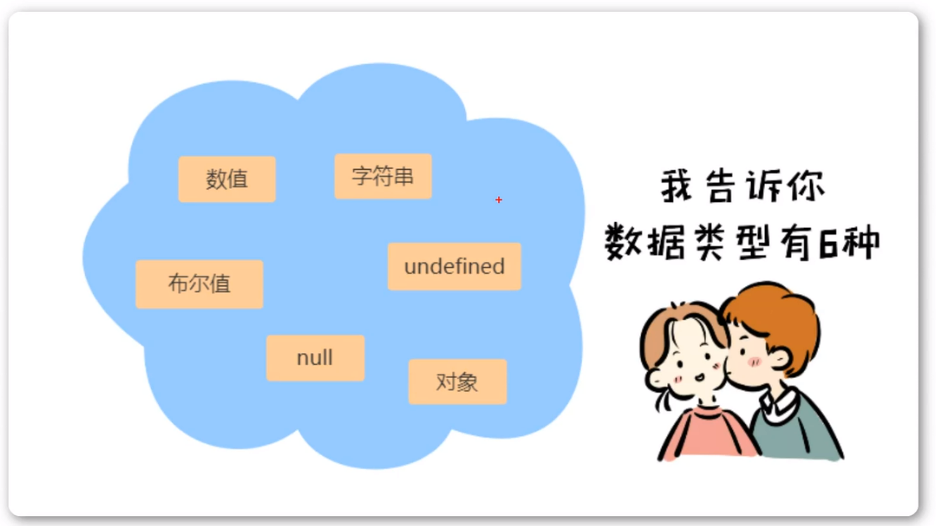
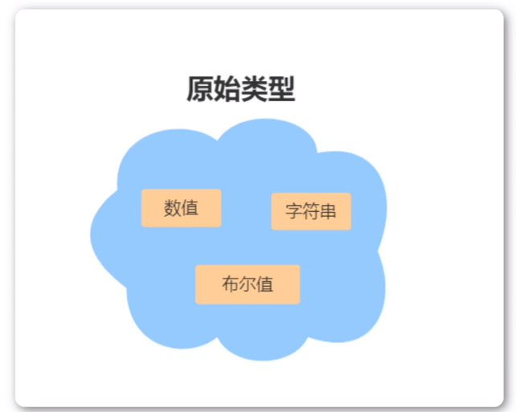
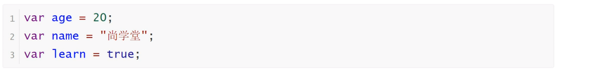
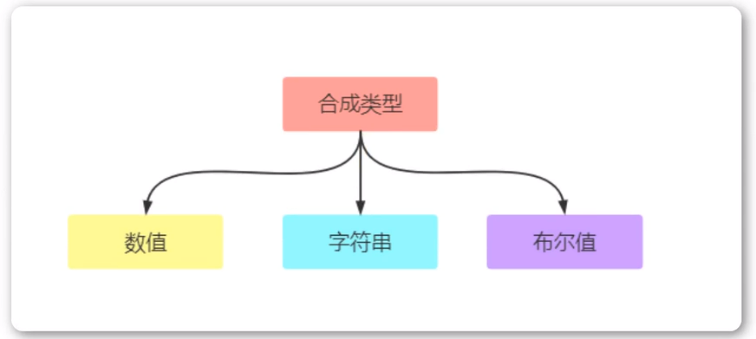
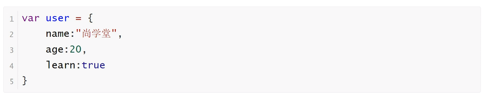

<h1>数据类型</h1>

<b style="font-size:20px">数据类型分类</b>

    JavaScript语言的每一个值，都属于某一种数据类型。JavaScript的数据类型，共有六种。（ES6又新增了第七种Symbol类型的值和第八种Biglnt类型，当前课程暂不涉及）

<b style="font-size:20px">数据类型分类</b>

<b>原始类型（基础类型）</b>

<b>合成类型（复合类型）</b>

对象：因为一个对象往往是多个原始类型的值的合成，可以看做是一个存放各种值的容器

