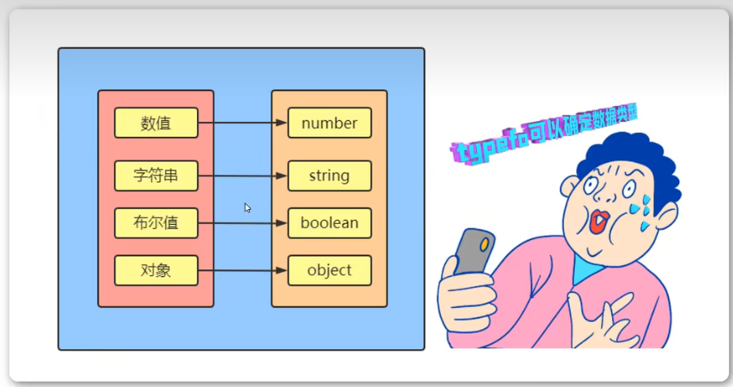

<h1>typeof运算符</h1>

JavaScript有三种方法，可以确定一个值到底是什么类型。而我们现在需要接触到的就是typeof

<b style="font-size:20px">数值返回number</b>

<b style="font-size:20px">字符串返回string</b>

<b style="font-size:20px">布尔值返回boolean</b>

<b style="font-size:20px">null和undefined的区别</b>

    null与undefined都可以表示“没有”，含义非常相似。将一个变量赋值为undefined或null，老实说，语法效果几乎没区别。既然含义与用法都差不多，为什么要同时设置两个这样的值，这不是无端增加复杂度，令初学者困扰吗？这与历史原因有关