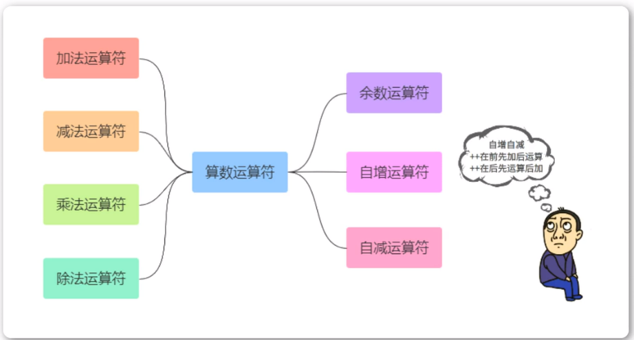
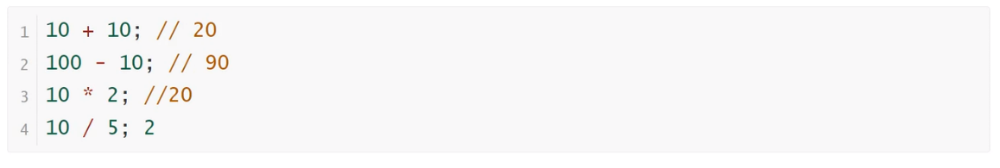
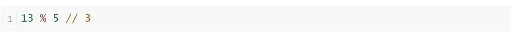
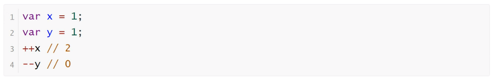
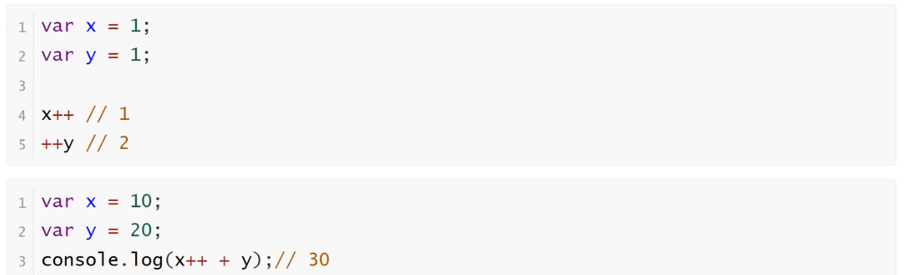

<h1>运算符之算术运算符</h1>

<b style="font-size:20px">加减乘除运算符</b>

    加减乘除运算符就是基本的数学运算符效果

<b style="font-size:20px">余数运算符</b>

    余数运算符是比较常用的，因为在逻辑思维上寻找规律，余数运算符是很好用的

<b style="font-size:20px">自增和自减运算符</b>

    自增和自减运算符，是一元运算符，只需要一个运算子。它们的作用是将运算子首先转为数值，然后加上1或者减去1
    自增和自减运算符有一个需要注意的地方，就是放在变量之后，会先返回变量操作前的值，再进行自增/自减操作；放在变量之前，会先进行自增/自减操作，再返回变量操作后的值。

